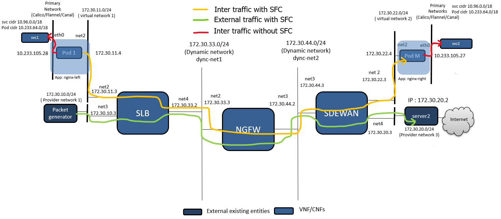

# Service Function Chaining(SFC) - Demo

## Summary

This project offers a means for deploying a Kubernetes cluster
that satisfies the requirements of Nodus sfc-setup

## Virtual Machines

This project uses [Vagrant tool][2] for provisioning Virtual Machines
automatically. The [setup](setup.sh) bash script contains the
Linux instructions to install dependencies and plugins required for
its usage. This script supports two Virtualization technologies
(Libvirt and VirtualBox).

```
    $ sudo ./setup.sh -p libvirt
```
There is a `default.yml` in the `./config` directory which creates multiple vm.

Once Vagrant is installed, it's possible to provision a vm using
the following instructions:
```
    $ vagrant up
```
In-depth documentation and use cases of various Vagrant commands [Vagrant commands][3]
is available on the Vagrant site.

## Deployment

### How to create K8s cluster?

Install the [docker](https://docs.docker.com/engine/install/ubuntu/) in the master, minion01 and minion02 vm.
Follow the steps in [create cluster kubeadm](https://kubernetes.io/docs/setup/production-environment/tools/kubeadm/create-cluster-kubeadm/) to create kubernetes cluster in master

### kubeadm
In the master node run the `kubeadm init` as below. The calico uses pod network cidr `10.210.0.0/16`
```
    $ kubeadm init --kubernetes-version=1.23.3 --pod-network-cidr=10.210.0.0/16 --apiserver-advertise-address=<master_eth0_ip_address>
```
Ensure the master node taint for no schedule is removed and labelled with `ovn4nfv-k8s-plugin=ovn-control-plane`
```
nodename=$(kubectl get node -o jsonpath='{.items[0].metadata.name}')
kubectl taint node $nodename node-role.kubernetes.io/master:NoSchedule-
kubectl label --overwrite node $nodename ovn4nfv-k8s-plugin=ovn-control-plane
```
Deploy the Calico and Multus CNI in the kubeadm master
```
     $ kubectl apply -f deploy/calico.yaml
     $ kubectl apply -f deploy/multus-daemonset.yaml
```
One of major change, we required to do for calico is to enable ip forwarding in the container network namespace.
This is enabled by macro `allow_ip_forwarding` to `true` in the calico cni configuration file.

There will be multiple conf files, we have to make sure Multus file is in the Lexicographic order.
Kubernetes kubelet is designed to pick the config file in the lexicograpchic order.

In this example, we are using pod CIDR as `10.210.0.0/16`. The Calico will automatically detect the CIDR based on the running configuration.
Since calico network going to the primary network in our case, nodus subnet should be a different network. Make sure you change the `ovn_subnet` and `ovn_gatewayip` in `deploy/ovn4nfv-k8s-plugin-sfc-setup-II.yaml`. Setup `Network` and `SubnetLen`as per user configuration.

In this example, we customize the ovn network as follows.
```
data:
  ovn_subnet: "10.154.142.0/18"
  ovn_gatewayip: "10.154.142.1/18"
  virtual-net-conf.json: |
    {
      "Network": "172.30.16.0/22",
      "SubnetLen": 24
    }
```
Deploy the Nodus Pod network to the cluster.
```
    $ kubectl apply -f deploy/ovn-daemonset.yaml
    $ kubectl apply -f deploy/ovn4nfv-k8s-plugin-sfc-setup-II.yaml
```
Join minion01 and minion02 by running the `kubeadm join` on each node as root as mentioned in [create cluster kubeadm](https://kubernetes.io/docs/setup/production-environment/tools/kubeadm/create-cluster-kubeadm/)

### notes
Calico by default could pick the interfaces without internet access. If user required to access internet access.
Run the following command to pick the interface that has internet access.

```
   $ kubectl set env daemonset/calico-node -n kube-system IP_AUTODETECTION_METHOD=can-reach=www.google.com
```

### TM1 server

ssh into the TM1 vm and run the following command to attach TM1 to the left provider network.
```
    $ ip addr flush dev eth1
    $ ip link add link eth1 name eth1.100 type vlan id 100
    $ ip link set dev eth1.100 up
    $ ip addr add 172.30.10.101/24 dev eth1.100
    $ ip route del default
    $ ip route add default via 172.30.10.3
```
### TM2 server

ssh into the TM2 vm and run the following command to attach TM2 to the right provider network.
```
    $ ip addr flush dev eth1
    $ ip link add link eth1 name eth1.200 type vlan id 200
    $ ip link set dev eth1.200 up
    $ ip addr add 172.30.20.2/24 dev eth1.200
```
Run the following commands to create virtual router
```
   $ ip route add 172.30.10.0/24 via 172.30.20.3
   $ ip route add 172.30.16.0/24 via 172.30.20.3
   $ ip route add 172.30.17.0/24 via 172.30.20.3
   $ ip route add 172.30.18.0/24 via 172.30.20.3
   $ ip route add 172.30.19.0/24 via 172.30.20.3
```
```
   $ echo 1 > /proc/sys/net/ipv4/ip_forward
   $ /sbin/iptables -t nat -A POSTROUTING -o eth0 -j MASQUERADE
   $ iptables -A FORWARD -i eth1 -o eth0 -j ACCEPT
   $ iptables -A FORWARD -i eth1.200 -o eth0 -j ACCEPT
```
## Demo setup

The setup show the SFC is connected to two network. One virtual and provider network.


let create the demo setup
```
   $ kubectl apply -f example/multus-net-attach-def-cr.yaml
   $ kubectl apply -f demo/calico-nodus-secondary-sfc-setup-II/deploy/sfc-private-network.yaml
   $ kubectl apply -f demo/calico-nodus-secondary-sfc-setup-II/deploy/slb-multiple-network.yaml
   $ kubectl apply -f demo/calico-nodus-secondary-sfc-setup-II/deploy/ngfw.yaml
   $ kubectl apply -f demo/calico-nodus-secondary-sfc-setup-II/deploy/sdewan-multiple-network.yaml
```
- The above commends created the multiple networks - provider-network-1 and provider-network-2. The corresponding vlan tagging is created in the nodes
- Dummy VFs application are deployed in this case are Smart Load balancer,Next Generation Firewall and Software Defined
Edge WAN. This could be replaced by the actual VFs application.

Next steps to deploy Pods and deploy the SFCs

```
    $ kubectl apply -f demo/calico-nodus-secondary-sfc-setup-II/deploy/namespace-right.yaml
    $ kubectl apply -f demo/calico-nodus-secondary-sfc-setup-II/deploy/namespace-left.yaml
    $ kubectl apply -f demo/calico-nodus-secondary-sfc-setup-II/deploy/nginx-left-deployment.yaml
    $ kubectl apply -f demo/calico-nodus-secondary-sfc-setup-II/deploy/nginx-right-deployment.yaml
    $ kubectl apply -f demo/calico-nodus-secondary-sfc-setup-II/deploy/sfc.yaml
```
Let trace the packet flow in the sfc for the internal and external traffic throug sfc

```
   $ kubectl get pods -A -o wide
NAMESPACE     NAME                                       READY   STATUS    RESTARTS   AGE     IP               NODE       NOMINATED NODE   READINESS GATES
default       ngfw-6f655d45f9-8kvtc                      1/1     Running   0          122m    10.210.50.69     minion01   <none>           <none>
default       sdewan-84d8999fb-9md6b                     1/1     Running   0          121m    10.210.50.70     minion01   <none>           <none>
default       slb-7b944df6f7-5fjh8                       1/1     Running   0          122m    10.210.50.68     minion01   <none>           <none>
kube-system   calico-kube-controllers-66d6894896-mmmrk   1/1     Running   0          144m    10.210.50.65     minion01   <none>           <none>
kube-system   calico-node-krkgr                          1/1     Running   0          140m    192.168.121.28   minion01   <none>           <none>
kube-system   calico-node-mpx2s                          1/1     Running   0          140m    192.168.121.13   master     <none>           <none>
kube-system   coredns-64897985d-9t2wf                    1/1     Running   0          3h12m   10.210.50.67     minion01   <none>           <none>
kube-system   coredns-64897985d-z2sjk                    1/1     Running   0          3h12m   10.210.50.66     minion01   <none>           <none>
kube-system   etcd-master                                1/1     Running   0          3h12m   192.168.121.13   master     <none>           <none>
kube-system   kube-apiserver-master                      1/1     Running   0          3h12m   192.168.121.13   master     <none>           <none>
kube-system   kube-controller-manager-master             1/1     Running   0          3h12m   192.168.121.13   master     <none>           <none>
kube-system   kube-multus-ds-amd64-bj5j7                 1/1     Running   0          142m    192.168.121.28   minion01   <none>           <none>
kube-system   kube-multus-ds-amd64-lbt98                 1/1     Running   0          142m    192.168.121.13   master     <none>           <none>
kube-system   kube-proxy-pb4nj                           1/1     Running   0          3h12m   192.168.121.13   master     <none>           <none>
kube-system   kube-proxy-vdj5g                           1/1     Running   0          3h11m   192.168.121.28   minion01   <none>           <none>
kube-system   kube-scheduler-master                      1/1     Running   0          3h12m   192.168.121.13   master     <none>           <none>
kube-system   nfn-agent-fsggl                            1/1     Running   0          138m    192.168.121.13   master     <none>           <none>
kube-system   nfn-agent-zkk5r                            1/1     Running   0          138m    192.168.121.28   minion01   <none>           <none>
kube-system   nfn-operator-76c5fdccfc-xdwqs              1/1     Running   0          138m    192.168.121.13   master     <none>           <none>
kube-system   ovn-control-plane-7dd9ff64c8-9hmwn         1/1     Running   0          140m    192.168.121.13   master     <none>           <none>
kube-system   ovn-controller-c94br                       1/1     Running   0          140m    192.168.121.28   minion01   <none>           <none>
kube-system   ovn-controller-pf8hb                       1/1     Running   0          140m    192.168.121.13   master     <none>           <none>
kube-system   ovn4nfv-cni-lfphh                          1/1     Running   0          138m    192.168.121.28   minion01   <none>           <none>
kube-system   ovn4nfv-cni-pb86s                          1/1     Running   0          138m    192.168.121.13   master     <none>           <none>
sfc-head      nginx-left-deployment-7476fb75fc-g6gvj     1/1     Running   0          115m    10.210.50.71     minion01   <none>           <none>
sfc-head      nginx-left-deployment-7476fb75fc-xfpxk     1/1     Running   0          115m    10.210.50.72     minion01   <none>           <none>
sfc-head      nginx-left-deployment-7476fb75fc-zxdsw     1/1     Running   0          115m    10.210.219.65    master     <none>           <none>
sfc-tail      nginx-right-deployment-965b96d57-v9twm     1/1     Running   0          114m    10.210.50.73     minion01   <none>           <none>
sfc-tail      nginx-right-deployment-965b96d57-wsnhc     1/1     Running   0          114m    10.210.219.67    master     <none>           <none>
sfc-tail      nginx-right-deployment-965b96d57-zcw6t     1/1     Running   0          114m    10.210.219.66    master     <none>           <none>

```
### Flow I
Let trace the packet from the left pod to right pod and left pod to internet
```
   $ kubectl exec -it nginx-right-deployment-965b96d57-v9twm -n sfc-tail -- ifconfig
eth0      Link encap:Ethernet  HWaddr CE:5A:18:B1:65:07  
          inet addr:10.210.50.73  Bcast:10.210.50.73  Mask:255.255.255.255
          UP BROADCAST RUNNING MULTICAST  MTU:1440  Metric:1
          RX packets:0 errors:0 dropped:0 overruns:0 frame:0
          TX packets:0 errors:0 dropped:0 overruns:0 carrier:0
          collisions:0 txqueuelen:0 
          RX bytes:0 (0.0 B)  TX bytes:0 (0.0 B)

lo        Link encap:Local Loopback  
          inet addr:127.0.0.1  Mask:255.0.0.0
          UP LOOPBACK RUNNING  MTU:65536  Metric:1
          RX packets:0 errors:0 dropped:0 overruns:0 frame:0
          TX packets:0 errors:0 dropped:0 overruns:0 carrier:0
          collisions:0 txqueuelen:1000 
          RX bytes:0 (0.0 B)  TX bytes:0 (0.0 B)

sn0       Link encap:Ethernet  HWaddr 1E:3E:B1:1E:13:05  
          inet addr:172.30.19.4  Bcast:172.30.19.255  Mask:255.255.255.0
          UP BROADCAST RUNNING MULTICAST  MTU:1400  Metric:1
          RX packets:0 errors:0 dropped:0 overruns:0 frame:0
          TX packets:0 errors:0 dropped:0 overruns:0 carrier:0
          collisions:0 txqueuelen:0 
          RX bytes:0 (0.0 B)  TX bytes:0 (0.0 B)

$ kubectl exec -it nginx-left-deployment-7476fb75fc-g6gvj -n sfc-head -- traceroute -n -q 1 -I 172.30.19.4
traceroute to 172.30.19.4 (172.30.19.4), 30 hops max, 46 byte packets
 1  172.30.16.3  1.114 ms
 2  172.30.17.4  0.603 ms
 3  172.30.18.4  0.426 ms
 4  172.30.19.4  0.264 ms
```
### Flow II
Before testing the next feature, please make sure the calico node and calico kube controller are up and running. Please refer the [Troubleshooting](https://projectcalico.docs.tigera.io/maintenance/troubleshoot/troubleshooting) for more info.

Let trace the packet from left pod to the Internet. The packet flow through the chain and then to virtual router(tm2) and reach the Internet.
If your setup up is behind the proxy. Please take care of your proxy setup before running these testing.
```
$ kubectl exec -it nginx-left-deployment-7476fb75fc-g6gvj -n sfc-head -- traceroute -n -q 1 -I google.com
traceroute to google.com (142.250.176.206), 30 hops max, 46 byte packets
 1  172.30.16.3  0.726 ms
 2  172.30.17.4  0.546 ms
 3  172.30.18.4  0.360 ms
 4  172.30.20.2  2.995 ms
 5  *
 6  10.11.16.1  1.169 ms
 7  132.177.125.249  4.522 ms
 8  132.177.123.1  1.219 ms
 9  132.177.100.4  1.617 ms
10  18.2.128.85  5.185 ms
11  192.5.89.38  11.587 ms
12  18.2.145.18  11.106 ms
13  108.170.248.33  12.485 ms
14  142.251.65.109  11.326 ms
15  142.250.176.206  11.298 ms
```
### Flow III
Let trace the packet from the server tm1-node to Internet through SFC
```
vagrant@tm1-node:~$ sudo traceroute -n -q 1 -I google.com
traceroute to google.com (142.251.41.14), 30 hops max, 60 byte packets
 1  172.30.10.3  3.281 ms
 2  172.30.17.4  3.210 ms
 3  172.30.18.4  3.304 ms
 4  172.30.20.2  4.248 ms
 5  *
 6  10.11.16.1  4.401 ms
 7  132.177.125.249  4.410 ms
 8  132.177.123.1  4.414 ms
 9  132.177.100.4  15.953 ms
10  18.2.128.85  8.494 ms
11  192.5.89.38  14.998 ms
12  18.2.145.18  14.727 ms
13  108.170.248.33  15.533 ms
14  142.251.53.149  14.763 ms
15  142.251.41.14  14.753 ms
```
### Flow IV
Let trace packet from pod to tm1-node server through SFC
```
kubectl exec -it nginx-right-deployment-965b96d57-v9twm -n sfc-tail -- traceroute -n -q 1 -I 172.30.10.101
traceroute to 172.30.10.101 (172.30.10.101), 30 hops max, 46 byte packets
 1  172.30.19.3  0.679 ms
 2  172.30.18.3  0.509 ms
 3  172.30.17.3  0.363 ms
 4  172.30.10.101  0.874 ms
```
## License

Apache-2.0

[1]: https://www.vagrantup.com/
[2]: https://www.vagrantup.com/docs/cli/
